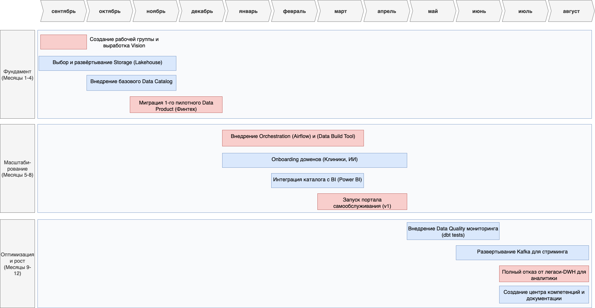

# 1. Технический радар архитектуры данных «Будущее 2.0»

## Обозначения категорий

- **ADOPT (Внедрять)**: Активно рекомендовать для новых проектов. Технологии являются стандартом де-факто.
- **TRIAL (Пробовать)**: Рекомендовать для пилотных проектов. Технологии многообещающи, но требуют оценки в контексте компании.
- **ASSESS (Оценивать)**: Изучать и оценивать потенциальную пользу. Принять решение о пилотировании в течение следующих 6-12 месяцев.
- **HOLD (Отложить)**: Не начинать новые проекты с этим. Планировать миграцию с этих технологий на рекомендуемые.

| Категория | Технология / Методология | Область применения | Обоснование и рекомендация |
|-----------|---------------------------|-------------------|----------------------------|
| **ADOPT** | Data Mesh | Архитектура, Методология | Стратегическое направление. Организационно-технологический подход для масштабирования управления данными и преодоления ограничений монолитного DWH. Основа для независимости доменов. |
| **ADOPT** | Data Lakehouse (S3, ADLS) | Хранилище, Платформа | Новое фундаментальное хранилище. Объединяет лучшее от Data Lakes (масштабируемость, низкая стоимость) и Data Warehouses (производительность, управление). |
| **ADOPT** | Delta Lake / Apache Iceberg | Формат данных | Открытые табличные форматы. Обеспечивают ACID-транзакции, версионность и высокую производительность поверх объектных хранилищ. Стандарт для Lakehouse. |
| **ADOPT** | Apache Spark | Обработка данных | Основной движок для ETL/ELT. Де-факто стандарт для распределенной обработки больших данных. Используется для преобразования данных в Data Products. |
| **ADOPT** | dbt (Data Build Tool) | Трансформация данных | Стандарт для трансформации. Позволяет применять software engineering practices (тестирование, документация, версионность) к пайплайнам данных. Для ELT-подхода. |
| **ADOPT** | Power BI Service | Визуализация, BI | Корпоративный стандарт для витрины самообслуживания. Уже используется, интегрируется с современным стэком. Использовать в связке с анализом данных в Lakehouse. |
| **TRIAL** | Apache Kafka | Стриминг данных | Для обработки событий в реальном времени. Рекомендуется для пилотов по потоковой передаче данных от Финтех-сервисов и IoT-устройств. |
| **TRIAL** | Data Contracts | Методология, Quality | Контракты на данные между производителями и потребителями. Пилотировать для обеспечения качества и надежности данных в рамках Data Mesh. |
| **TRIAL** | Databricks Unity Catalog | Каталог, Управление | Единый каталог для управления данными и доступом. Пилотировать как потенциальное enterprise-решение для централизованного управления метаданными и безопасностью. |
| **ASSESS** | Apache Flink | Стриминг данных | Альтернатива Spark Streaming для low-latency processing. Оценить для сценариев, требующих сверхмалой задержки в обработке событий. |
| **ASSESS** | MLflow | MLOps | Для управления жизненным циклом ML-моделей. Оценить необходимость внедрения, когда ИИ-сервисы начнут активно использовать платформу для обучения моделей. |
| **HOLD** | Monolithic DWH (MS SQL 2008) | Хранилище | Устаревшая технология. Не масштабируется, дорога в поддержке, является узким горлом. План: Поэтапный вывод из эксплуатации. |
| **HOLD** | ETL-подход | Методология | Устаревший паттерн. Трансформация до загрузки создает задержки и сложность. План: Переход на ELT-подход в Lakehouse. |
| **HOLD** | Power Builder | UI, Приложение | Устаревшая клиент-серверная технология. Не поддерживает современные веб-стандарты и интеграции. План: Миграция на веб-портал. |
| **HOLD** | Apache Camel (для ETL) | Интеграция | Использование не по назначению. Сложный и неэффективный инструмент для batch-обработки данных. План: Оставить только для интеграции legacy-систем, данные перенаправлять через Kafka/Gateway. |

## 2. Дорожная карта (Roadmap) трансформации

Дорожная карта разбита на три ключевых этапа, реализуемых последовательно в течение 12 месяцев.

### Пояснения к диаграмме:
- **Красный цвет (критические Milestones)**: Ключевые точки на карте проекта, которые отмечают достижение фундаментально важного результата. Их срыв ставит под угрозу весь проект или следующие этапы.
- **Синий цвет (рабочие задачи)**: Непосредственно работы, которые необходимо выполнить для достижения Milestones

### Ответственные команды:

- **Data Platform Team**: Центральная команда, отвечающая за развертывание и поддержку платформы (квадранты "Platform")
- **Domain Data Teams**: Рабочие группы в каждом домене (Финтех, Клиники и т.д.), отвечающие за создание своих Data Products
- **Center of Excellence (CoE)**: Кросс-функциональная группа архитекторов и ведущих инженеров, определяющая стандарты и best practices

## 3. Обоснование изменений и этапов роадмапа

### Этап 1: Фундамент (Месяцы 1-4)

**Зачем это нужно?** Нельзя менять архитектуру без четкого vision и команды. Этот этап создает организационный и технологический фундамент для всей дальнейшей работы.

**Ключевые действия:**

- **Рабочая группа**: Без закрепленной ответственности и единого видения проект обречен на провал.
- **Cloud Storage (Lakehouse)**: Это основа всей новой архитектуры. Без надежного и масштабируемого хранилища все дальнейшие шаги бессмысленны. Выбор открытых форматов (Delta/Parquet) гарантирует нам гибкость на decades вперед.
- **Пилотная миграция (Финтех)**: Необходимо быстро получить первую победу (quick win), отработать процесс миграции на реальном кейсе, показать value бизнесу и сгенерировать уверенность в успехе всего проекта.

### Этап 2: Масштабирование (Месяцы 5-8)

**Зачем это нужно?** После успеха пилота необходимо масштабировать подход на всю компанию, дав доменам инструменты для самостоятельной работы и предоставив бизнесу первые tangible результаты в виде портала.

**Ключевые действия:**

- **Orchestration (Airflow) и dbt Core**: Это инструменты автоматизации и стандартизации. Они позволяют доменным командам самостоятельно, но по единым правилам, создавать и поддерживать свои Data Products. Это сердце реализации Data Mesh.
- **Onboarding доменов**: Расширяем coverage данных. Вовлекаем следующие ключевые домены в процесс, чтобы создать сетевой эффект и ценность от кросс-доменной аналитики.
- **Портал самообслуживания (v1)**: Главный результат для бизнес-пользователей. Позволяет им самостоятельно находить данные и строить отчеты, напрямую снижая нагрузку на IT и ускоряя принятие решений.

### Этап 3: Оптимизация и рост (Месяцы 9-12)

**Зачем это нужно?** После решения первоочередных задач необходимо работать над качеством, надежностью и расширением возможностей платформы, одновременно завершая отказ от старого мира.

**Ключевые действия:**

- **Data Quality мониторинг**: Данные без доверия бесполезны. Внедрение автоматического мониторинга качества — ключевой шаг для превращения данных в настоящий надежный актив.
- **Kappa для стриминга**: Переход от batch-обработки к обработке данных в реальном времени для тех use cases, где это критически важно (мониторинг fraud, актуальная аналитика).
- **Полный отказ от легаси-DWH**: Финальный шаг, закрепляющий успех. Полное прекращение использования старого DWH для аналитических нагрузок позволяет отключить его и значительно сократить затраты на лицензии и поддержку.
- **Центр компетенций**: Задача — сделать архитектуру устойчивой и не зависящей от отдельных людей. Документация и обучение гарантируют, что новые сотрудники смогут быстро влиться в процесс, а лучшие практики будут формализованы.
